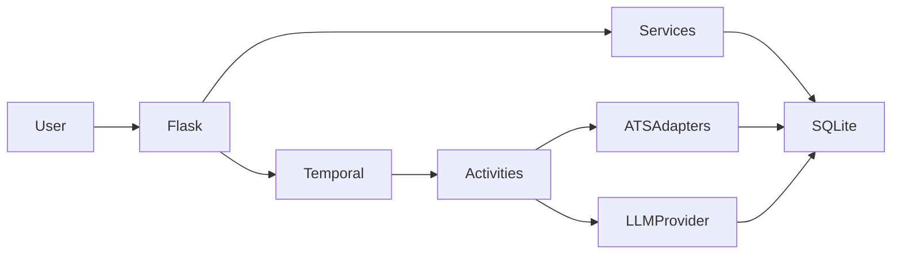

# Architecture

Head Hunter is composed of a Flask UI, SQLite persistence layer, Temporal-based orchestration boundary, ATS adapters, and an LLM provider interface.

## Data flow

## Determinism guidance

- Temporal workflows must remain deterministic.
- HTTP, filesystem, database, timestamp, and provider interactions belong in activities.
- Flask requests should trigger workflows, not perform scans inline.

## Security boundaries

- Candidate profile data stays local.
- Secrets live in `.env`, never in version-controlled config.
- Public templates should not include private profile content.
