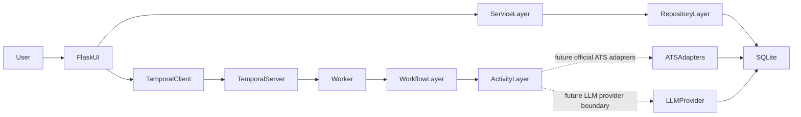

# Architecture

Head Hunter is organized around a local Flask UI, a service and repository layer, SQLite persistence, and a separate Temporal orchestration boundary for future scheduled workflows.

## Data flow

## Phase 2 company registry boundary

- Flask routes collect form input, show Bootstrap views, and trigger service methods.
- Services enforce lifecycle invariants, scan-block rules, import and export rules, and audit generation.
- Repositories encapsulate persistence and query behavior.
- SQLite remains the business system of record.

## Determinism guidance for future workflows

- Temporal workflows must remain deterministic.
- HTTP, filesystem, timestamp, provider, and database interactions belong in activities.
- Flask requests should start workflows through the Temporal client rather than perform long-running work inline.

## Security and privacy boundaries

- The private candidate profile lives in `skillset.local.md` and stays local.
- `SKILLSET.md` is a public template only.
- Secrets live in `.env`, never in repository-tracked config.
- Candidate-specific workflows fail closed when the private profile is unavailable.
